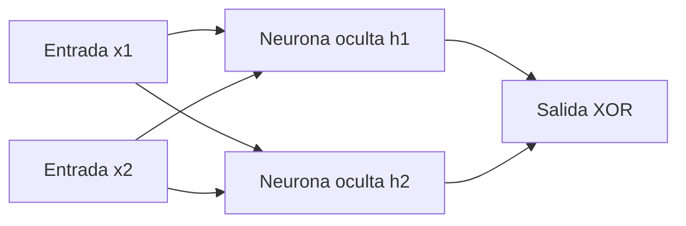

# Red neuronal XOR con backpropagation

Este proyecto implementa manualmente una red neuronal para aprender la
compuerta XOR. La arquitectura tiene dos entradas, dos neuronas ocultas y una
salida sigmoide.

## Grafo de nodos



La red utiliza `9` parámetros entrenables: cuatro pesos y un sesgo por cada
neurona oculta, más dos pesos y un sesgo en la neurona de salida.

## Resultado del entrenamiento

Configuración utilizada:

- Semilla aleatoria: `0`
- Épocas: `20 000`
- Tasa de aprendizaje: `1.0`
- Pérdida final: `0.000475`

| Entrada | Salida calculada | Clase predicha | Objetivo |
| --- | ---: | ---: | ---: |
| `0 XOR 0` | `0.000615` | `0` | `0` |
| `0 XOR 1` | `0.999575` | `1` | `1` |
| `1 XOR 0` | `0.999575` | `1` | `1` |
| `1 XOR 1` | `0.000434` | `0` | `0` |

Las cuatro entradas fueron clasificadas correctamente.

## Ejecución

```powershell
uv run Deber2.py
```
