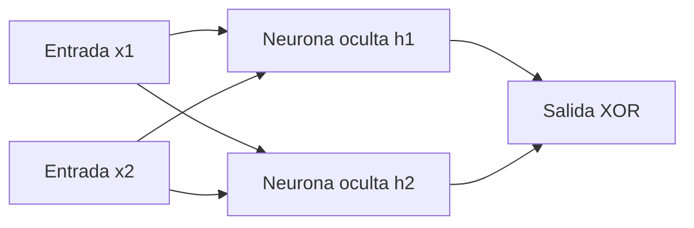

# RBackpropagation con descenso de gradiente hasta 20000 epocas

Este proyecto implementa manualmente una red neuronal para aprender la
compuerta XOR. La arquitectura tiene dos entradas, dos neuronas ocultas y una
salida sigmoide.

## Grafo de nodos



La red utiliza `9` parámetros entrenables: cuatro pesos y un sesgo por cada
neurona oculta, más dos pesos y un sesgo en la neurona de salida.

## Resultado del entrenamiento

Configuración utilizada:

- Semilla aleatoria: `0`
- Épocas: `20 000`
- Tasa de aprendizaje: `1.0`
- Pérdida final: `0.000475`

### Resultado humanizado

Con esta configuración, la red neuronal necesitó como mínimo **365 épocas**
para aprender la lógica XOR y clasificar correctamente las cuatro
combinaciones de entrada. En ese punto, sus salidas fueron aproximadamente
`0.153`, `0.680`, `0.697` y `0.499`, que corresponden a las clases `0`, `1`,
`1` y `0`. Aunque la red ya acertaba desde la época 365, se mantuvo el
entrenamiento hasta las `20 000` épocas para refinar las predicciones y reducir
la pérdida final a `0.000475`.

| Entrada | Salida calculada | Clase predicha | Objetivo |
| --- | ---: | ---: | ---: |
| `0 XOR 0` | `0.000615` | `0` | `0` |
| `0 XOR 1` | `0.999575` | `1` | `1` |
| `1 XOR 0` | `0.999575` | `1` | `1` |
| `1 XOR 1` | `0.000434` | `0` | `0` |

Las cuatro entradas fueron clasificadas correctamente.

## Ejecución

```powershell
uv run Deber2.py
```
